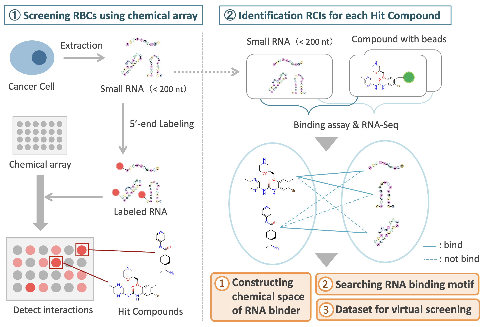
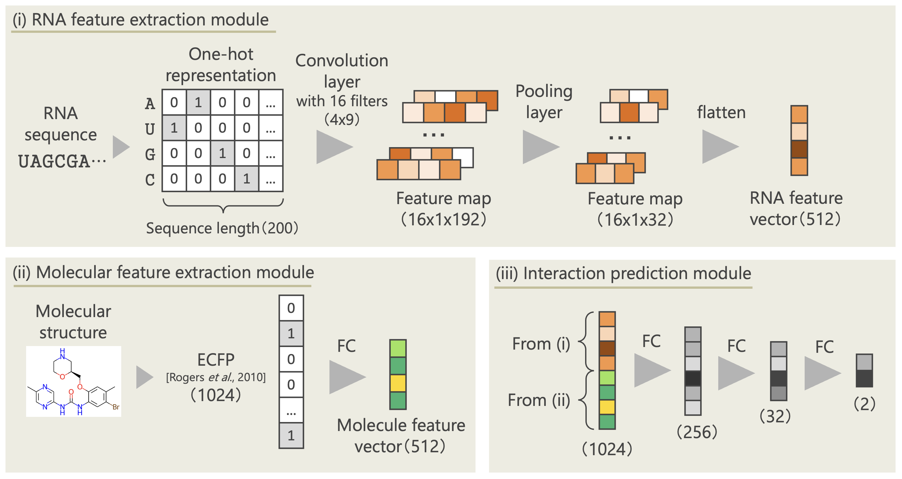

# Title

## Paper abstruct
The non-coding RNAs, which constitute about 70% of the human genome, have been shown to be involved in various biological processes and pathologies, and are attracting attention as novel drug targets. While studies identifying small molecules that bind to RNA have been conducted in various ways, the knowledge accumulated is insufficient compared to proteins. By using a various non-coding RNAs extracted from cells, chemical arrays on which numerous compounds are immobilized, and next-generation sequencer, we have obtained comprehensive many-to-many RNA compound interactions (RCIs) in a high-throughput manner. Analysis of the acquired data has revealed novel RNA motif structures and characteristic compound structures. Furthermore, the obtained data include experimentally validated non-interaction pairs. By combining the data with existing RCI databases, we realized more general _in silico_ RCI predictions compared to existing methods.

  

## RCIP overview
We have constructed an _in silico_ RNA compound interaction prediction (RCIP) system based on deep learning techniques. The RCIP utilizes the CNN model shown in the figure below. The CNN model consists of three modules: (i) feature extraction using convolutional layers from RNA sequences, (ii) feature extraction using fully connected layers from compound structures, and (iii) interaction prediction from the extracted features. The model needs only RNA sequence and compound structures as input, and performs binary classification of interaction presence or absence.

  

## Requiments
RCIP is tested to work under Python 3.7.7 with packages below.
    * numpy
    * pandas
    * rdkit
    * scikit-learn
    * torch

You can build an anaconda environment using the following command.

    $ conda env create -f py37_rcip.yaml
    $ conda activate py37_rcip
    $ cd ./RCIP

## Dataset
The data used in this research are located in the `/data` folder. `/dataset.csv` consists of interaction data used for training and evaluation. The columns “ID_I”, “ID_S”, and “ID_R” are identifiers of interactions, compounds, and RNAs respectively, assigned uniquely for this study. The “Sequence” column contains RNA sequences, the “SMILES” column contains the SMILES representation of compound structures, and the “Label” column indicates the presence or absence of interactions with 1 or 0. The “Subset” column indicates which subset the data belongs to. The “Link” column contains identifiers for each database in SubsetX. `/testset_c.csv` is the interaction dataset for TestC. You can train and test model with your own dataset by locating in the `/data` folder. However, be careful to the datasets including “Sequence”, “SMILES”, and “Label” columns.

## Program usage
You can run RCIP system with specifying which process to perform using the `--mode` argument, while other arguments are specified in `/config.yaml`. The `session_id` argument is used to distinguish multiple models as sessions. Additionally, all results are saved in the `/result` folder, and the records for each session are logged in `/log.txt`.

### Parameter tuning

    $ python rcip.py --mode param_tuning

You can check the best scores and parameters in the `/log.txt`.

### Train

    $ python rcip.py --mode train

You can demonstrate model training with X+Y+Z dataset the same as this research using `--example` argument.

    $ python rcip.py --mode train --example

The values of loss, AUROC, and AUPRC for each epoch are saved as CSV file. The values of last epoch are recorded in `/log.txt`, and trained weights are stored in `/ckpt` folder.

### Test
When you specify `cv` for the `--mode` argument, it performs cross-validation on the training data, while specifying `test` evaluates the model using the test set. You can use the weights specified in the `trained_weight_file` argument in `/config.yaml`, and if not specified, the weights obtained from training within the same session are automatically selected.

    $ python rcip.py --mode cv
    $ python rcip.py --mode test

By using the `--example` argument, you can conduct cross-validation on X+Y+Z data and perform tests on TestA, TestB, and TestC datasets the same as this research.

    $ python rcip.py --mode cv --example
    $ python rcip.py --mode test --example

### RNA sequence motif detection
The results of visualizing the locations with the highest matching scores based on the importance of filters derived from SE-Blocks will be recorded in `/log.txt`. Additionally, you can execute the visualization for multiple sequences by specifying them in `/config.yaml`.

    $ python rcip.py --mode motif_detection

## Citing

## License
